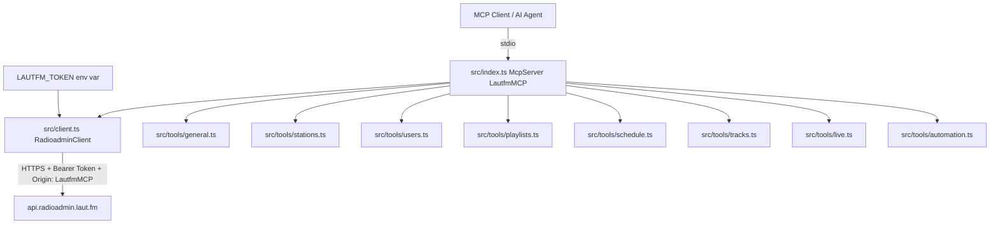

# Implementation Plan: laut.fm Radioadmin MCP Server

## Quick Analysis

### Workspace Check
- [ ] Existing pattern identified: No existing code — greenfield project
- [ ] Dependencies confirmed: None yet installed; all marked as NEW below
- [ ] Test pattern identified: No existing tests — not in scope for initial build

### Gaps/Questions
- [ ] Authentication: The API uses `bearerAuth` (Radioadmin token). The token will be read from the `LAUTFM_TOKEN` environment variable (name to confirm).
- [ ] Binary/multipart endpoints (image upload, MP3 upload, prelisten audio) are not well-suited for MCP text tools — these will be noted as out-of-scope or return URLs only.
- [ ] The `App`-tagged endpoints (JWT-based, for mobile app users) are excluded — they use a different auth scheme (Firebase JWT) and are not relevant to the Radioadmin use case.

---

## What to Build

A TypeScript MCP server that wraps the laut.fm Radioadmin REST API (`https://api.radioadmin.laut.fm`). The server reads a bearer token from the `LAUTFM_TOKEN` environment variable, sets `Origin: LautfmMCP` on every request, and exposes all relevant API operations as MCP tools. It communicates over stdio (standard MCP transport).

---

## Files to Create

| Path | Purpose |
|------|---------|
| `package.json` | Node.js project manifest with scripts and dependencies |
| `tsconfig.json` | TypeScript compiler configuration |
| `src/index.ts` | MCP server entry point — registers all tools, starts stdio transport |
| `src/client.ts` | Thin HTTP client wrapper (fetch-based) with auth header and Origin injection |
| `src/tools/general.ts` | Tool: `get_server_status` |
| `src/tools/stations.ts` | Tools: `list_stations`, `get_station`, `update_station`, `get_station_state`, `activate_station`, `get_current_playlist`, `get_listener_stats` |
| `src/tools/users.ts` | Tools: `get_station_users`, `add_station_user`, `update_station_user_role`, `remove_station_user` |
| `src/tools/playlists.ts` | Tools: `get_playlists`, `add_playlist`, `get_playlist`, `update_playlist`, `delete_playlist`, `add_track_to_playlist`, `get_playlist_tracks`, `delete_track_from_playlist` |
| `src/tools/schedule.ts` | Tools: `get_schedule`, `update_schedule` |
| `src/tools/tracks.ts` | Tools: `search_tracks`, `get_tracks_by_ids`, `update_track`, `delete_track`, `get_track_stats`, `get_track_stats_period`, `get_track_tags_for_ids`, `add_track_tags`, `remove_track_tags`, `get_all_track_tags`, `get_incomplete_tracks`, `get_queued_tracks` |
| `src/tools/live.ts` | Tools: `get_live_connection_info`, `get_live_password` |
| `src/tools/automation.ts` | Tools: `get_automation_algorithm`, `create_automation_algorithm`, `update_automation_algorithm`, `delete_automation_algorithm` |
| `README.md` | Setup instructions, env var documentation, tool listing |

---

## Implementation Approach

### Pattern to Follow
No existing pattern in workspace. Follow the standard `@modelcontextprotocol/sdk` pattern:
- Create a `McpServer` instance
- Register tools with `server.tool(name, description, zodSchema, handler)`
- Connect via `StdioServerTransport`

### Technical Details

#### Project Setup
- Runtime: Node.js 18+
- Language: TypeScript
- Build: `tsc` → `dist/`
- Entry: `node dist/index.js`

#### Dependencies (all NEW)
| Package | Purpose |
|---------|---------|
| `@modelcontextprotocol/sdk` | MCP server framework |
| `zod` | Input schema validation for tool parameters |
| `typescript` | TypeScript compiler (dev) |
| `@types/node` | Node.js type definitions (dev) |

Node's built-in `fetch` (Node 18+) will be used — no additional HTTP library needed.

#### HTTP Client (`src/client.ts`)
```
Base URL: https://api.radioadmin.laut.fm
Headers on every request:
  Authorization: Bearer <LAUTFM_TOKEN>
  Origin: LautfmMCP
  Content-Type: application/json  (for POST/PATCH/PUT with JSON body)
```

Token is read at startup: `process.env.LAUTFM_TOKEN`. If missing, the server throws an error on startup.

#### Tool Registration Pattern (`src/index.ts`)
```typescript
import { McpServer } from "@modelcontextprotocol/sdk/server/mcp.js";
import { StdioServerTransport } from "@modelcontextprotocol/sdk/server/stdio.js";

const server = new McpServer({ name: "LautfmMCP", version: "1.0.0" });
// register tools from each module
const transport = new StdioServerTransport();
await server.connect(transport);
```

#### Tool Response Pattern
All tools return `{ content: [{ type: "text", text: JSON.stringify(data, null, 2) }] }`.
Errors return `{ content: [{ type: "text", text: "Error: <message>" }], isError: true }`.

#### Excluded Endpoints
- `POST /stations/{station_id}/tracks` — MP3 binary upload (not suitable for MCP text tool)
- `PUT /stations/{station_id}/images/{image_type}` — binary image upload
- `GET /stations/{station_id}/tracks/{track_id}/prelisten` — returns audio/mpeg binary
- All `App`-tagged endpoints (JWT/Firebase auth, different use case)

---

## Tool Inventory

### General
| Tool | Method | Endpoint |
|------|--------|---------|
| `get_server_status` | GET | `/server_status` |

### Station
| Tool | Method | Endpoint |
|------|--------|---------|
| `list_stations` | GET | `/stations` |
| `get_station` | GET | `/stations/{station_id}` |
| `update_station` | PATCH | `/stations/{station_id}` |
| `get_station_state` | GET | `/stations/{station_id}/state` |
| `activate_station` | POST | `/stations/{station_id}/state` |
| `get_current_playlist` | GET | `/stations/{station_id}/current_playlist` |
| `get_listener_stats` | GET | `/stations/{station_id}/stats` |

### Users
| Tool | Method | Endpoint |
|------|--------|---------|
| `get_station_users` | GET | `/stations/{station_id}/users` |
| `add_station_user` | POST | `/stations/{station_id}/users` |
| `update_station_user_role` | PATCH | `/stations/{station_id}/users/{user_id}` |
| `remove_station_user` | DELETE | `/stations/{station_id}/users/{user_id}` |

### Playlists
| Tool | Method | Endpoint |
|------|--------|---------|
| `get_playlists` | GET | `/stations/{station_id}/playlists` |
| `add_playlist` | POST | `/stations/{station_id}/playlists` |
| `get_playlist` | GET | `/stations/{station_id}/playlists/{playlist_id}` |
| `update_playlist` | PATCH | `/stations/{station_id}/playlists/{playlist_id}` |
| `delete_playlist` | DELETE | `/stations/{station_id}/playlists/{playlist_id}` |
| `add_track_to_playlist` | POST | `/stations/{station_id}/playlists/{playlist_id}` |
| `get_playlist_tracks` | GET | `/stations/{station_id}/playlists/{playlist_id}/tracks` |
| `delete_track_from_playlist` | DELETE | `/stations/{station_id}/playlists/{playlist_id}/entries/{track_id}` |

### Schedule
| Tool | Method | Endpoint |
|------|--------|---------|
| `get_schedule` | GET | `/stations/{station_id}/schedule` |
| `update_schedule` | PATCH | `/stations/{station_id}/schedule` |

### Tracks
| Tool | Method | Endpoint |
|------|--------|---------|
| `search_tracks` | GET | `/stations/{station_id}/tracks` (deprecated, query params) |
| `get_tracks_by_ids` | GET | `/stations/{station_id}/tracks/{track_ids}` (comma-separated) |
| `update_track` | PATCH | `/stations/{station_id}/tracks/{track_id}` |
| `delete_track` | DELETE | `/stations/{station_id}/tracks/{track_id}` |
| `get_track_stats` | GET | `/stations/{station_id}/tracks/stats` |
| `get_track_stats_period` | GET | `/stations/{station_id}/tracks/stats/{period}` |
| `get_track_tags_for_ids` | GET | `/stations/{station_id}/tracks/{track_ids}/tags` |
| `add_track_tags` | POST | `/stations/{station_id}/tracks/{track_ids}/tags` |
| `remove_track_tags` | DELETE | `/stations/{station_id}/tracks/{track_ids}/tags` |
| `get_all_track_tags` | GET | `/stations/{station_id}/tracks/tags` |
| `get_incomplete_tracks` | GET | `/stations/{station_id}/tracks;incomplete` |
| `get_queued_tracks` | GET | `/stations/{station_id}/tracks;queued` |

### Live
| Tool | Method | Endpoint |
|------|--------|---------|
| `get_live_connection_info` | GET | `/stations/{station_id}/live` |
| `get_live_password` | GET | `/stations/{station_id}/live/password` |

### Automation Algorithms
| Tool | Method | Endpoint |
|------|--------|---------|
| `get_automation_algorithm` | GET | `/automation_algorithms/{name}` |
| `create_automation_algorithm` | PUT | `/automation_algorithms/{name}` |
| `update_automation_algorithm` | PATCH | `/automation_algorithms/{name}` |
| `delete_automation_algorithm` | DELETE | `/automation_algorithms/{name}` |

---

## Architecture Diagram



---

## Integration

- The MCP server is registered in the MCP client config (e.g. Claude Desktop `mcp_servers`) as:
  ```json
  {
    "lautfm": {
      "command": "node",
      "args": ["dist/index.js"],
      "env": { "LAUTFM_TOKEN": "<your-token>" }
    }
  }
  ```
- The server name `"LautfmMCP"` is used both as the MCP server name and as the `Origin` header value on all API requests.

---

## Success Criteria
- [ ] `LAUTFM_TOKEN` env var is required; server exits with clear error if missing
- [ ] All 37 tools are registered and callable
- [ ] Every API request includes `Authorization: Bearer <token>` and `Origin: LautfmMCP`
- [ ] Tool inputs are validated with Zod schemas matching the OpenAPI parameter definitions
- [ ] Successful responses return JSON-formatted text content
- [ ] HTTP errors (400, 403, 404) are surfaced as `isError: true` tool responses with the API error message
- [ ] Binary/multipart endpoints are excluded with a note in README
- [ ] `npm run build` compiles without errors
- [ ] README documents all tools, env vars, and MCP client configuration

---

## Constraints
- Do not implement binary upload tools (MP3, images) — not suitable for MCP text protocol
- Do not implement App/JWT endpoints — different auth scheme, out of scope
- Token must never be hardcoded; always read from environment
- Origin header must be exactly `LautfmMCP` on every request
- Use Node 18+ built-in `fetch`; do not add axios or node-fetch

---

## Validation
Before proceeding:
- [ ] Pattern reference: `@modelcontextprotocol/sdk` McpServer + StdioServerTransport (standard pattern, no existing file to reference in workspace)
- [ ] Dependencies confirmed or flagged as [NEW] — all are NEW
- [ ] No assumptions made — uncertainties documented above

---

> **Review required:** Please review this plan before implementation proceeds. Switch to Code mode to implement once approved.
